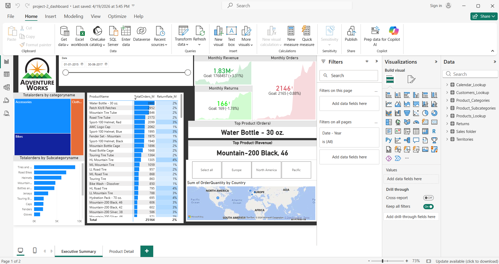
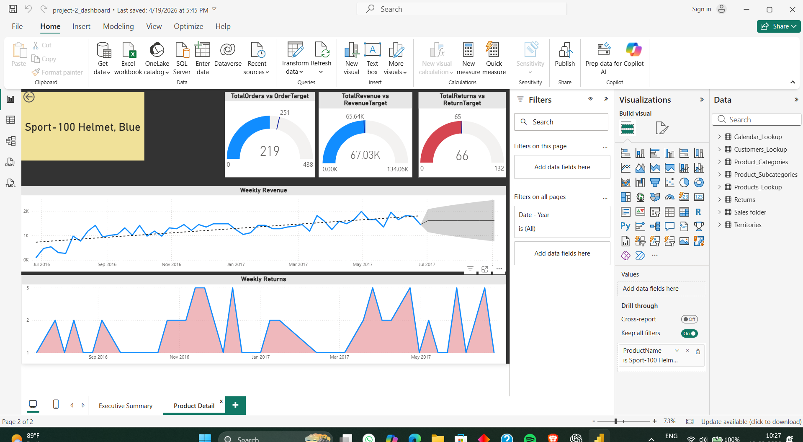

# AdventureWorks Sales Dashboard

## 📊 Project Overview

The AdventureWorks Sales Dashboard is an interactive Power BI project developed to analyze sales performance and provide meaningful business insights.

The dashboard helps understand revenue trends, order performance, customer behavior, product performance, returns, and regional sales using interactive visualizations and filters.

---

## 🎯 Business Objective

The main objective of this project is to analyze sales data and answer important business questions such as:

- How is overall sales performance changing over time?
- Which products and categories generate the most revenue?
- Which regions perform best?
- How many orders and customers are contributing to sales?
- What is the return rate?
- Which products or areas require attention?
- What are the major sales trends and patterns?

---

## 🛠️ Tools & Technologies

- Power BI
- DAX
- Data Modeling
- Data Cleaning
- Data Transformation
- Data Visualization
- Microsoft Excel / CSV

---

## 📁 Dataset

The project uses AdventureWorks sales data containing multiple business tables, including:

- Sales data
- Customers
- Products
- Product Categories
- Product Subcategories
- Returns
- Territories
- Calendar

The datasets are available in the `Datasets` folder of this repository.

---

## 🧹 Data Preparation

The raw datasets were prepared and structured before building the dashboard.

Key steps included:

- Cleaning and organizing the raw data
- Checking data types and formatting
- Creating relationships between tables
- Building a date/calendar structure
- Preparing data for analysis
- Creating a structured data model in Power BI

---

## 📐 DAX & Calculations

DAX was used to create important business metrics and calculations.

Key KPIs included:

- Total Revenue
- Total Orders
- Total Customers
- Total Products
- Return Rate
- Sales Trends
- Product Performance
- Regional Performance

These measures helped create interactive and dynamic dashboard insights.

---

## 📊 Dashboard Features

The dashboard includes interactive visualizations and analysis such as:

### Executive Summary

- Overall sales performance
- Revenue trends
- Order and customer KPIs
- Regional analysis
- Return analysis
- High-level business insights

### Product Analysis

- Product performance
- Category and subcategory analysis
- Top-performing products
- Revenue contribution
- Product trends

### Interactive Features

- Slicers
- Filters
- Drill-downs
- KPI cards
- Charts and graphs
- Interactive data exploration

---

## 🔍 Key Insights

The dashboard was used to identify:

- Sales trends over time
- Top-performing products and categories
- Differences in regional sales performance
- Customer and order patterns
- Product return patterns
- Areas with stronger and weaker sales performance

These insights can help businesses understand their sales performance and make data-driven decisions.

---

## 🖼️ Dashboard Preview

### Executive Summary



### Product Detail



---

## 📂 Repository Structure

```text
adventureworks-sales-dashboard
│
├── AdventureWorks_Sales_Dashboard.pbix
│
├── Datasets
│   ├── Calendar.csv
│   ├── Categories.csv
│   ├── Customers.csv
│   ├── Product_Categories.csv
│   ├── Product_Subcategories.csv
│   ├── Products.csv
│   ├── Returns.csv
│   ├── Sales_2015.csv
│   ├── Sales_2016.csv
│   ├── Sales_2017.csv
│   └── Territories.csv
│
├── Screenshots
│   ├── EXECUTIVE_SUMMARY.png
│   └── PRODUCT_DETAIL.png
│
└── README.md
